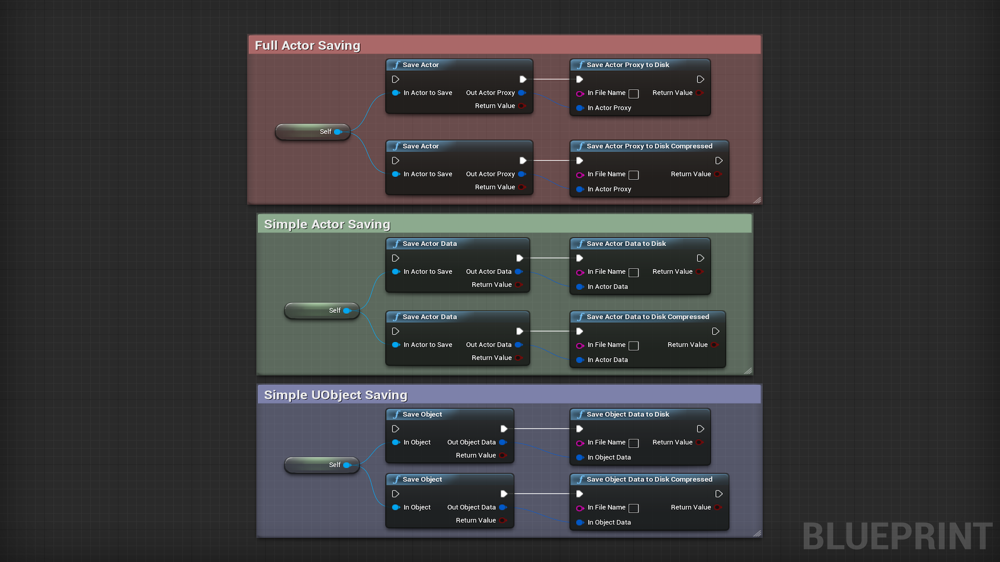
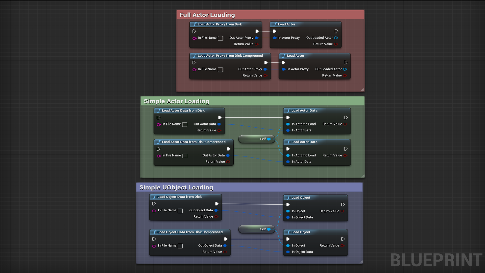

# Numbskull Serialization
## A simple and free serialization plugin

This plugin is currently used in the unreleased game _Beyond Binary_ by _Numbskull Studios_. The plugin was created because _Unreal_'s _SaveGame_ system didn't meet the requirments for _Beyond Binary_.

The majority of code sits inside the _NumbskullSerializationBPLibrary_ file with simple methods like _SaveActor_ and _SaveActorProxyToDisk_.


## Brief Overview


#### Bool Returns

Each method in the library returns a bool to indicate success or failure. More logging will be added to help with debugging.

#### Storage Types

The library includes three main object types for storing data from an object or actor:

- Actor Data (Holds serialized data and the actor's transform)
- Actor Proxy (Holds serialized data as well as class, name and transform)
- Object Data (Holds only serialized data)

Methods like `SaveActor`, `SaveActorData` and `SaveObjectData` will return these storage types.

These storage types can be easily saved with `SaveActorProxyToDisk`, `SaveActorDataToDisk` and `SaveObjectDataToDisk`.

## How To Use (Object Data)

- Include `NumbskullSerializationBPLibrary.h`
- Add the `ISerializable` interface to your class
- Declare in the header

```
virtual void OnSave_Implementation(const FString& GameName) override;
virtual void OnLoad_Implementation(const FString& GameName) override;
```
- Save `this` object with

```
FObjectData ObjectData;
UNumbskullSerializationBPLibrary::SaveObject(this, GameData);
UNumbskullSerializationBPLibrary::SaveObjectDataToDisk(GameName + TEXT("MyFile.dat"), ObjectData);
```

- Load `this` object with

```
FObjectData ObjectData;
UNumbskullSerializationBPLibrary::LoadObjectDataFromDisk(GameName + TEXT("MyFile.dat"), GameData);
UNumbskullSerializationBPLibrary::LoadObject(this, ObjectData);
```

## How To Use (Actor Data)

- Include `NumbskullSerializationBPLibrary.h`
- Add the `ISerializable` interface to your class
- Declare in the header

```
virtual void OnSave_Implementation(const FString& GameName) override;
virtual void OnLoad_Implementation(const FString& GameName) override;
```
- Save `this` actor with

```
FObjectData ObjectData;
UNumbskullSerializationBPLibrary::SaveActorData(this, GameData);
UNumbskullSerializationBPLibrary::SaveActorDataToDisk(GameName + TEXT("MyFile.dat"), ObjectData);
```

- Load `this` actor with

```
FObjectData ObjectData;
UNumbskullSerializationBPLibrary::LoadActorDataFromDisk(GameName + TEXT("MyFile.dat"), GameData);
UNumbskullSerializationBPLibrary::LoadActorData(this, ObjectData);
```

## How To Use (Actor Proxy)

`ActorProxies`s save the entirety of an actor so it can be respawned during loading.
The intended use is for dynamically spawned enemies or equipment on the player like a sword.

It's best practice for an object like the `GameMode` to save and load these objects as, while a dynamically created object can save itself, they can't load themselves as they won't exist on new level loads.

- Include `NumbskullSerializationBPLibrary.h`
- Add the `ISerializable` interface to your class
- Declare in the header

```
virtual void OnSave_Implementation(const FString& GameName) override;
virtual void OnLoad_Implementation(const FString& GameName) override;
```
- Save a dynamically created actor with

```
AActor* ActorToSave;

FActorProxy ActorProxy;
UNumbskullSerializationBPLibrary::SaveActor(ActorToSave, ActorProxy);
UNumbskullSerializationBPLibrary::SaveActorProxyToDisk(GameName + TEXT("Actor.dat"), ActorProxy);
```

- Load the dynamically created actor

```
AActor* ActorToLoad = nullptr;

FActorProxy ActorProxy;
UNumbskullSerializationBPLibrary::LoadActorDataFromDisk(GameName + TEXT("Actor.dat"), ActorProxy);
UNumbskullSerializationBPLibrary::LoadActor(GetWorld(), ActorProxy, ActorToLoad);

ActorToLoad->AnyMethodAsTheActorIsLoaded();
```




